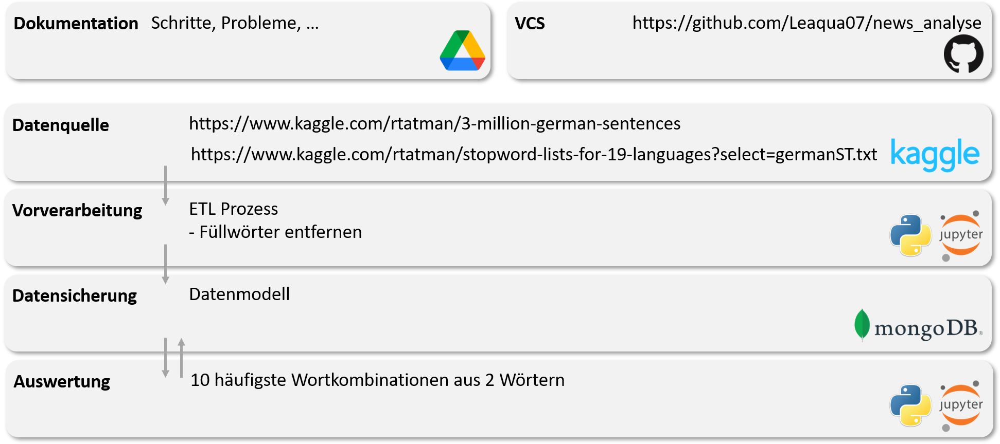

# news_analyse
Seminaraufgabe Data Warehouse

Zeitungssätze, Top 10 Wortkombinationen

## Allgemeine Anforderungen
- Die Umsetzung und Erarbeitung der Aufgabe fi ndet innerhalb der angemeldeten Teams statt.
- Die technischen Entscheidungen, das funktionstüchtige System und Analysergebnisse werden in 20 Minuten dargestellt und präsentiert. 
- Die Zusammenarbeit mit anderen Arbeitsteams ist zulässig. Der Einfluss auf die Entscheidungen muss in der Präsentation dargestellt werden.
- Weitere Datenquellen sind für das Ergebnis nicht notwendig, können nach eigenem Wunsch jedoch in die Lösung aufgenommen werden. Sind dann aber auch in der Präsentation nennen.
- Die Folien und Schnappschüsse der Bildschirminhalte sind spätestens 1 Tag vor Präsentation einzureichen.
- Empfohlene Toolauswahl (sofern nicht vorgegeben):
    - Google BigQuery
    - Pentaho Data Integration
    - MongoDB
    - Apache Cassandra
    - PostgreSQL
    - MariaDB
    - Apache Kylin
    - Mondrian OLAP Server
    - Pentaho Business Analytics
    - Elasticsearch
- Bei abweichenden Tools bitte möglichst Open Source oder durch Firmen bereitgestellte Tools bevorzugen.

## Augabenstelllung
➔ Story:
- Als Daten-Analyst benötige ich eine Daten- und Analysebasis, um Data-Mining durchführen zu können. 
- Hierzu ist ein Datenmodell zu entwerfen, die genannten Datenquellen sind in ein DWH-System zu integrieren 
und eine Analysemöglichkeit ist bereitzustellen.

➔ Abnahmekriterien:
- Es wurde ein Datenmodell zur Analyse der Daten entworfen und aufgesetzt.
- Es wurde ein ETL Prozess aufgesetzt, der die Inhalte der Datenquellen in das Datenmodell integriert.
- In den Daten können folgenden Analysen durchgeführt werden: 
– Die Entscheidungen für Datenmodell, ETL-Prozess, Tool-Auswahl und Analysemöglichkeiten 
können präsentiert werden.
– Es exitiert eine Analyse, die ermittelt, welches die 10 häufi gsten deutschen Wortkombinationen 
aus zwei Wörtern sind. Füllwörter wurden von der Analyse ausgeschlossen.

➔ Datenquellen:
- 3 Million German Sentences; German language data from the Leipzig Corpus Collection
    - https://www.kaggle.com/rtatman/3-million-german-sentences

## geplanter Aufbau
